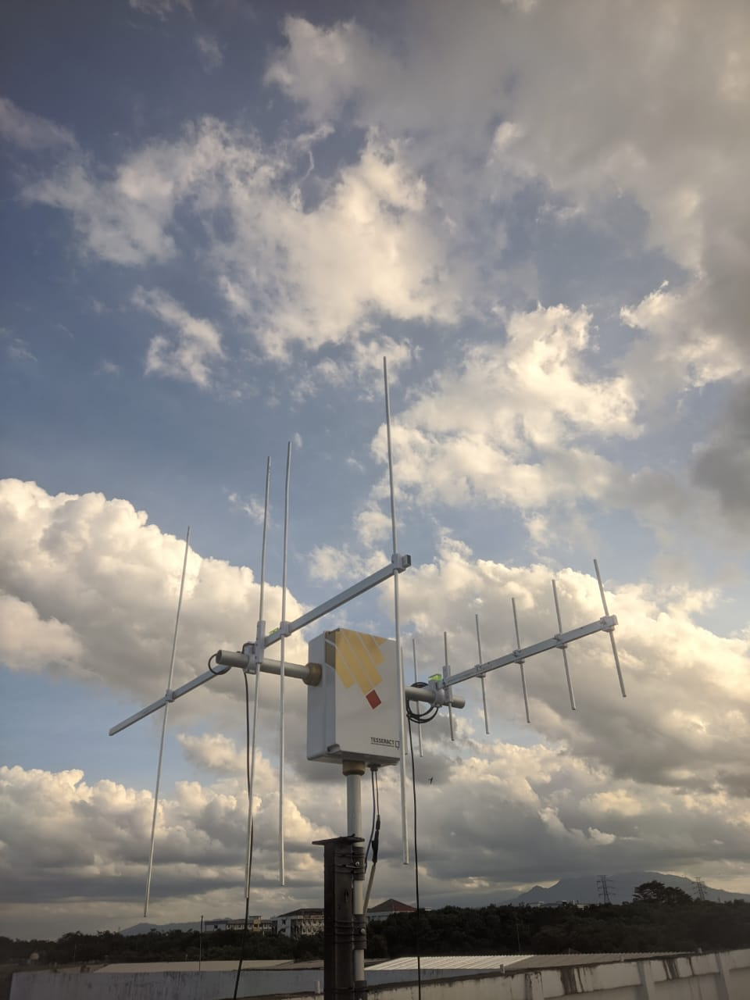

# TESSERACT
This research focuses on developing an antenna rotator capable of tracking satellites, thereby enhancing the quality of signals during satellite contact. The rotator is based on an Arduino Uno microcontroller, coupled with a NEMA-17 stepper motor, which drives a 3D-printed gearbox with a 60:1 ratio. The motor operates in 1/8 step mode. The SatDump software is employed for controlling the rotator and providing input for the satellite’s position through the Hamlib interface and firmware developed by SatNOGS. The antenna, made from aluminum, exhibits an SWR value of approximately 1.62 in the VHF band and 1.81 in the UHF band. The rotator achieves optimal pointing accuracy at elevations between 0° and 30°, with azimuth and elevation slew speeds of 3.978°/second and 3.598°/second on rising elevation, respectively, and 3.618°/second on descending elevation. Tracking tests conducted on the NOAA-19 and LAPAN A2 satellites demonstrate that the developed rotator and antenna combination significantly improves the consistency of signal reception during satellite contact, across a range of elevation angles.

